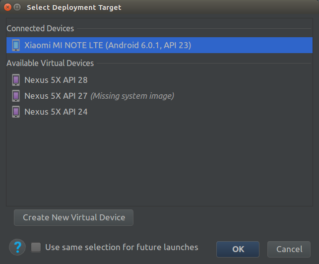

# ros2-android-tutorial

This is a short tutorial for developing Android apps for ROS2 Java bindings based on [ros2_java](https://github.com/esteve/ros2_java.git) and [ros2_android_examples](https://github.com/esteve/ros2_android_examples.git).

## Installation (Only for Linux)

Download Android Studio from [here](https://developer.android.com/studio/).

Download the latest stable version Android NDK from [the official website](https://developer.android.com/ndk/downloads/) then unpack it to ```~/Android/Sdk/```, name it as ```ndk-bundle```, so the path will be ```~/Android/Sdk/ndk-bundle```.

Check your JAVA version:

```bash
update-java-alternatives -l
```

You might be able to spot the path from output, it will be something like this:

```/usr/lib/jvm/java-1.8.0-openjdk-amd64```

Copy the path from the output. Then, add following lines to the bottom of ```/etc/environment```.

```bash
JAVA_HOME="[###REPLACE THIS WITH YOUR JAVA PATH###]"
ANDROID_HOME=~/Android/Sdk
ANDROID_NDK=~/Android/Sdk/ndk-bundle
```


Build ROS2_JAVA on Linux computer. 

```bash
# define paths
ROOT_DIR = ${HOME}
AMENT_WORKSPACE=${ROOT_DIR}/ament_ws
ROS2_ANDROID_WORKSPACE=${ROOT_DIR}/ros2_android_ws

# pull and build ament
mkdir -p ${AMENT_WORKSPACE}/src
cd ${AMENT_WORKSPACE}
wget https://raw.githubusercontent.com/esteve/ament_java/master/ament_java.repos
vcs import ${AMENT_WORKSPACE}/src < ament_java.repos
src/ament/ament_tools/scripts/ament.py build --symlink-install --isolated

# android build configuration
export PYTHON3_EXEC="$( which python3 )"
export ANDROID_ABI=armeabi-v7a
export ANDROID_NATIVE_API_LEVEL=android-21
export ANDROID_TOOLCHAIN_NAME=arm-linux-androideabi-clang

# pull and build ros2 for android
mkdir -p ${ROS2_ANDROID_WORKSPACE}/src
cd ${ROS2_ANDROID_WORKSPACE}
wget https://raw.githubusercontent.com/esteve/ros2_java/master/ros2_java_android.repos
vcs import ${ROS2_ANDROID_WORKSPACE}/src < ros2_java_android.repos
source ${AMENT_WORKSPACE}/install_isolated/local_setup.sh
ament build --isolated --skip-packages test_msgs \
  --cmake-args \
  -DPYTHON_EXECUTABLE=${PYTHON3_EXEC} \
  -DCMAKE_TOOLCHAIN_FILE=$ANDROID_NDK/build/cmake/android.toolchain.cmake \
  -DANDROID_FUNCTION_LEVEL_LINKING=OFF \
  -DANDROID_NATIVE_API_LEVEL=${ANDROID_NATIVE_API_LEVEL} \
  -DANDROID_TOOLCHAIN_NAME=${ANDROID_TOOLCHAIN_NAME} \
  -DANDROID_STL=gnustl_shared \
  -DANDROID_ABI=${ANDROID_ABI} \
  -DANDROID_NDK=${ANDROID_NDK} \
  -DTHIRDPARTY=ON \
  -DCOMPILE_EXAMPLES=OFF \
  -DCMAKE_FIND_ROOT_PATH="$AMENT_WORKSPACE/install_isolated;$ROS2_ANDROID_WORKSPACE/install_isolated" \
  -- \
  --parallel \
  --ament-gradle-args \
  -Pament.android_stl=gnustl_shared -Pament.android_abi=$ANDROID_ABI -Pament.android_ndk=$ANDROID_NDK --
```

For more instruction: <https://github.com/esteve/ros2_java#android>

---


### Try out Android examples

Github repo: <https://github.com/esteve/ros2_android_examples>

**Method1:** Install APK through Android Studio

Firstly, plug in your android phone to your computer via USB cable and make sure you have enable **developer options** and **USB debugging** in your phone settings.

After that, open [ros2_talker_android](https://github.com/esteve/ros2_android_examples/tree/master/ros2_talker_android) or [ros2_listener_android](https://github.com/esteve/ros2_android_examples/tree/master/ros2_listener_android) in Android Studio, click 'Build', then click 'Run' and choose your device.



---


**Method2:** Install APK through command line

Firstly, plug in your android phone to your computer via USB cable and make sure you have enable **developer options** and **USB debugging** in your phone settings.

After that, run the following commands on your computer:

Talker:

```bash
adb install ~/ros2_android_ws/install_isolated/ros2_talker_android/ros2_talker_android-debug.apk
```

Listener:

```bash
adb install ~/ros2_android_ws/install_isolated/ros2_listener_android/ros2_listener_android-debug.apk
```

### Add ROS2 packages

When you want to develop your own ROS2 Android app, you might want to import additional ROS2 packages for additional features.

To import ROS2 library into your Android project:

In your ```gradle.properties```, add the package path to ```ament.dependencies``` and ```ament.exec_dependency_paths_in_workspace``` variables:

For example:

```properties
//...
ament.dependencies=...\:/home/rmf/ros2_android_ws/install_isolated/geometry_msgs/share/geometry_msgs
//...
ament.exec_dependency_paths_in_workspace=...\:/home/rmf/ros2_android_ws/install_isolated/geometry_msgs/share/geometry_msgs
//...
```

### ROS2 Node in Java

To start a ROS2 Node:

```java
talkerNode = new TalkerNode("android_talker_node", "chatter");
```

To add a node:

```java
getExecutor().addNode(talkerNode);
```

To remove a node:

```java
getExecutor().removeNode(talkerNode);
```


### Import Android library

1. Open your project in Android Studio
2. Download the library (using Git, or a zip archive to unzip)
3. Create a folder "subProject" in your project
4. Copy and paste the FreemiumLibrary folder to your subProject folder
5. On the root of your project directory create/modify the settings.gradle file. It should contain something like the following:

```
include ':virtualjoystick'
project(':virtualjoystick').projectDir = new File('libs/virtual-joystick-android/virtualjoystick')
```

6. gradle clean & build/close the project and reopen/re-import it.
7. Edit your project's build.gradle to add this in the "depencies" section:

```
dependencies {
// ...
  compile project(':virtualjoystick')
}
```

8. Edit your App Activities to extend AdsFragmentActivity instead of Activity.
9. Edit the library if you want to [use it with ActionBarCompat](https://github.com/MagicMicky/FreemiumLibrary/wiki/Tips#use-freemiumlibrary-with-actionbarcompat)

